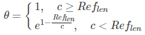
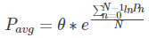

# **BLEU评估指标原理**

机器翻译是自然语言处理中的一个热门方向，有许多大家生活中常用的应用都需要这一技术，如百度翻译等。接下来本博客就介绍机器翻译模型的一个重要评价指标——BLEU。

## 一、简要介绍

**1.1** BLEU，Bilingual Evalution Understudy，双语评估辅助工具

**1.2** BLEU是IBM于2002年在ACL发表的“BLEU: a Method for Automatic Evaluation of Machine Translation”一文中提出的，用于机器翻译任务的评价，引用次数已达17533次(数据来自谷歌学术)。

**1.3 作用：** 在机器翻译领域，需要一个指标来衡量机器翻译的结果与专业人工翻译结果的差异，一般情况下需要专业的翻译人员介入评估模型翻译的好坏, 但是这样需要大量的人力参与。 因此是否有一种机器的评估方法用于判断翻译的好坏而不需要人工介入, 这种评估方法虽然准确度并不高, 但是可以粗略的反应出当前模型的好坏。于是BLEU就是这样的情况下作为一个比较好的用于衡量翻译文本质量的指标。

## 二、何为BLEU

在机器翻译任务中，BLEU 和 ROUGE 是两个常用的评价指标，BLEU 根据精确率(Precision)衡量翻译的质量，而 ROUGE 根据召回率(Recall)衡量翻译的质量。

假如给定标准译文$reference$，神经网络生成的句子是$candidate$，句子长度为n，$candidate$中有m个单词出现在$reference$，那么m / n就是BLEU的**1-gram**的计算公式。
* **什么是1-gram？**
    * N-gram是一种基于统计语言模型的算法。它的基本思想是将文本里面的内容按照字节进行大小为N的滑动窗口操作，形成了长度是N的字节片段序列。

那么1-gram就是将文本按单个单词进行划分。最基础的BLEU(BLEU-1)衡量的是单词级别的准确性，更高阶的BLEU可以衡量句子的流畅性。

BLEU还有许多变种。根据n-gram可以划分成多种评价指标，常见的指标有BLEU-1、BLEU-2、BLEU-3、BLEU-4四种。

## 三、计算公式

### **3.1 分子释义**

神经网络生成的句子是$candidate$，给定的标准译文是$reference$。

（1）第一个 $∑$ 统计的是所有的$candidate$，因为计算时可能有多个句子。

（2）第二个 $∑$ 统计的是一条$candidate$中所有的$n−gram$个数。

所以整个分子就是在给定的

$candidate$中有多少个$n-gram$词语出现在$reference$中。

### **3.2 分母释义**

求和符号和分子中的含义一样，$Count(n-gram')$表示$n−gram′$在$candidate$中的个数，综上可知，分母是获得所有的$candidate$中$n-gram$的个数。

### **3.3 几何平均精度**

以上公式是长度为n的所有$gram$的BLEU计算公式，由于$n$的取值可以从1取到$candidate$的长度，假设$candidate$总的单词长度为$N$，需要将最终得到的这$N$个BLEU进行整合。使用求加权几何平均数的方法对这$N$个$precision$(即BLEU)求出平均精度。

假设权值序列为
$$
W_n,n=0,1,2,...,N - 1
$$
可以求得几何加权平均的公式为：

通常权值全部取1，因此可以得到简化的几何平均精度：

## 四、示例

### **示例一**

**candidate**: paddlepaddle is a deep learning framework made by Baidu

**reference**: paddlepaddle is one of the products made by Baidu

就$BLEU_2$来说，对 $candidate$中的8个词{paddlepaddle is, is a, a deep, deep learning, learning framework, framework made, made by, by Baidu}。查找是否在$reference$中，发现有3个词{paddlepaddle is, made by, by Baidu}在$reference$中，所以占比就是3 / 8。

各个BLEU的值如下：

* $BLEU_1 = \frac{5}{9}$

* $BLEU_2 = \frac{3}{8}$

* $BLEU_3 = \frac{1}{7}$

* $BLEU_4 = \frac{0}{6}$

### **示例二**

**candidate**: is is is is is is is is is

**reference**: paddlepaddle is one of the products made by Baidu

上一部分的计算公式中，分子的Count有个clip操作，如果没有clip，对于示例二计算出来的BLEU将是9 / 9，因为$candidate$中的每个词都出现在了$reference$中。

## 五、添加对句子长度的惩罚因子
改良型BLEU的计算公式基本可以解决翻译中的常见词汇对翻译结果评估的影响。在翻译时，若出现译文很短的句子时，往往会有较高的BLEU值。例如：

**candidate**：the cat

**reference1**：the cat is on the mat

**reference2**：there is a cat on the mat

根据计算平均精度的公式，可以计算出$P_{avg} = 1$

因此我们需要引入对短句的惩罚因子BP。如果我们逐句计算短句的惩罚并计算平均值，那么短句上的长度偏差将受到较大的惩罚。

此处定义一个概念：当$candidate$的长度等于任何一个$reference$的长度的时候，称此时为最佳匹配，不需要对翻译结果进行惩罚；当$candidate$的长度与每个$reference$的长度都不相等的时候，引入一个参考长度，记作$Ref_{len}$同时定义$candidate$的长度为$c$，那么惩罚因子计算公式为：

因此含有惩罚因子的BLEU最终的计算公式为：

## 六、总结
6.1 BLEU是一个非常简单、快速、粗略的评估机器翻译准确率的指标,当面对多个翻译模型且需要快速选择模型的场景, 可以使用这个指标来评估模型的好坏, 但是在需要精确评估翻译文本质量的场景, 这个指标就不是那么适用了。当然，BLEU也可以用于文本生成的验证上。

6.2 以下给出一个可以在线计算BLEU值的网站：https://www.letsmt.eu/Bleu.aspx

6.3 当然，很多用于机器翻译的包里面就有计算BLEU的代码，比如tensor2tensor，安装完后执行： t2t-bleu --reference=REFERENCE --translation=TRANSLASTION

(以上REFERENCE和TRANSLATION都是文本文件名)

6.4 “BLEU: a Method for Automatic Evaluation of Machine Translation”一文提到BLEU方法要求有参考译文，对于没有参考译文的全新内容的翻译，BLEU方法是不适用的。需要注意的是，一般给出的reference是多句话，之所以给出多个句子，是因为单个句子可能无法和生成的句子做很好地匹配。
